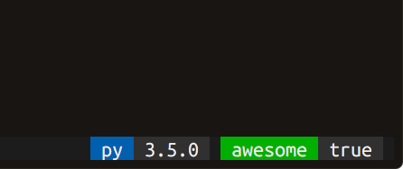

# tmux-badges

Enables you to do fancy badges a-la shields.io in tmux.
Usage example:

```
# tmux.conf
set -g @badge_py     'py'
set -g @badge_py_fg  'default'
set -g @badge_py_bg  'colour25'
set -g @badge_py_cmd 'pyenv version | cut -f 1 -d " "'

set -g @badge_awesome 'awesome'
set -g @badge_awesome_cmd 'echo true'

set -g status-right ' #{badge_py} #{badge_awesome} '
```


